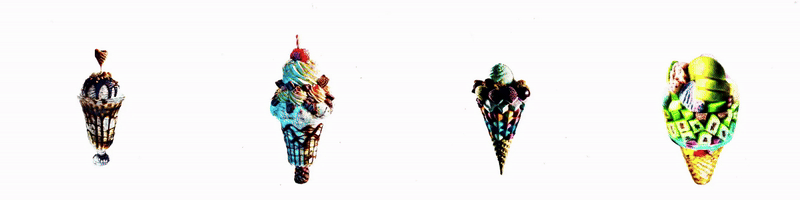
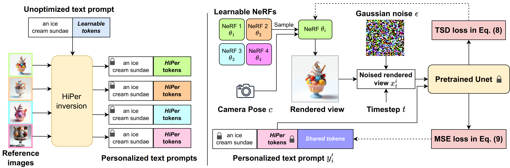

<!-- ##### Table of contents
1. [Installation](##-Installation-:hammer:)
2. [Data Preparation](#Data_Preparation) 
3. [Run the code](#Run_the_code)
4. [Acknowledgments](#Acknowledgments) -->

# DiverseDream: Diverse Text-to-3D Synthesis with Augmented Text Embedding [ECCV'24](https://eccv.ecva.net/)
[Uy Dieu Tran](), [Minh Luu](), [Phong Ha Nguyen](https://phongnhhn.info/), [Khoi Nguyen](https://www.khoinguyen.org), and [Binh-Son Hua](https://sonhua.github.io/)

<a href="https://diversedream.github.io/"></a>
<a href="https://arxiv.org/abs/2312.02192"></a>

<p align="center">

</p>

> **Abstract**: 
Text-to-3D synthesis has recently emerged as a new approach to sampling 3D models by adopting pretrained text-to-image models as guiding visual priors. An intriguing but underexplored problem with existing text-to-3D methods is that 3D models obtained from the sampling-by-optimization procedure tend to have mode collapses, and hence poor diversity in their results. In this paper, we provide an analysis and identify potential causes of such a limited diversity, which motivates us to devise a new method that considers the joint generation of different 3D models from the same text prompt. We propose to use augmented text prompts via textual inversion of reference images to diversify the joint generation. We show that our method leads to improved diversity in text-to-3D synthesis qualitatively and quantitatively.



Details of the model architecture and experimental results can be found in [our paper](https://arxiv.org/abs/2312.02192):
```bibtext
@inproceedings{DiverseDream,
      title={Diverse Text-to-3D Synthesis with Augmented Text Embedding}, 
      author={Uy Dieu Tran and Minh Luu and Phong Ha Nguyen and Khoi Nguyen and Binh-Son Hua},
      year={2024},
      booktitle={Proceedings of the European Conference on Computer Vision},
}
```
**Please CITE** our paper whenever this repository is used to help produce published results or incorporated into other software.

## Installation
The following steps have been tested on Ubuntu20.04.

- You must have an NVIDIA graphics card with at least 6GB VRAM and have [CUDA](https://developer.nvidia.com/cuda-downloads) installed.
- Install `Python >= 3.8`.
- (Optional, Recommended) Create a virtual environment:

```sh
python3 -m virtualenv venv
. venv/bin/activate

# Newer pip versions, e.g. pip-23.x, can be much faster than old versions, e.g. pip-20.x.
# For instance, it caches the wheels of git packages to avoid unnecessarily rebuilding them later.
python3 -m pip install --upgrade pip
```

- Install `PyTorch >= 1.12`. We have tested on `torch1.12.1+cu113` and `torch2.0.0+cu118`, but other versions should also work fine.

```sh
# torch1.12.1+cu113
pip install torch==1.12.1+cu113 torchvision==0.13.1+cu113 --extra-index-url https://download.pytorch.org/whl/cu113
# or torch2.0.0+cu118
pip install torch torchvision --index-url https://download.pytorch.org/whl/cu118
```

- (Optional, Recommended) Install ninja to speed up the compilation of CUDA extensions:

```sh
pip install ninja
```

- Install dependencies:

```sh
pip install -r requirements.txt
```

- (Optional) `tiny-cuda-nn` installation might require downgrading pip to 23.0.1

## Training
- For generating HiPer token using textual inversion. Note that we need to create folder **images** under **OUT_PATH** and put all reference images under this folder
```sh
cd HiPer
MODEL_PATH="stable-diffusion-v1-4"
OUT_PATH="output_hiper/A_high_quality_photo_of_an_ice_cream_sundae"
PROMPT="A high quality photo of ice cream sundae"
python multi_hiper.py \
--pretrained_model_name "$MODEL_PATH" \
--folder_path "$OUT_PATH" \
--source_text "$PROMPT" \
--n_hiper=5 \
--emb_learning_rate=5e-3 \
--emb_train_steps=1500 \
--seed 200000
cd ..
```

- For generating 3D object
```sh
PROMPT="A high quality photo of ice cream sundae"
HIPER_PATH="output_hiper/A_high_quality_photo_of_an_ice_cream_sundae/hiper_5/ckpt"

# VSD with HiPer
python launch.py --config configs/tsd.yaml --train --gpu 0 system.prompt_processor.prompt="$PROMPT" system.n_particles=8 system.prompt_processor.hiper_scale=0.9 system.guidance.token_len=8 system.hiper_path="$HIPER_PATH" name="vsd_w_hiper" system.guidance.use_lora=true

# TSD
python launch.py --config configs/tsd.yaml --train --gpu 0 system.prompt_processor.prompt="$PROMPT" system.n_particles=8 system.prompt_processor.hiper_scale=0.9 system.guidance.token_len=8 system.hiper_path="$HIPER_PATH" system.guidance.use_lora=false
```

## Evaluation
```sh
cd evaluate
RENDER_FOLDER='outputs/tsd/A_high_quality_photo_of_ice_cream_sundae/save/it50000-test'
OUTPUT_DIR='evaluate_results'
NAME='TSD'
N_PARTICLE=8

python eval.py --render_folder "$RENDER_FOLDER" \
            --output_dir "$OUTPUT_DIR" \
            --name "$NAME" \
            --n_particles $N_PARTICLE \
```

## Acknowledgements
Thanks for all contributor of public repositories [Threestudio](https://github.com/threestudio-project/threestudio), [HiPer](https://github.com/HiPer0/HiPer)
